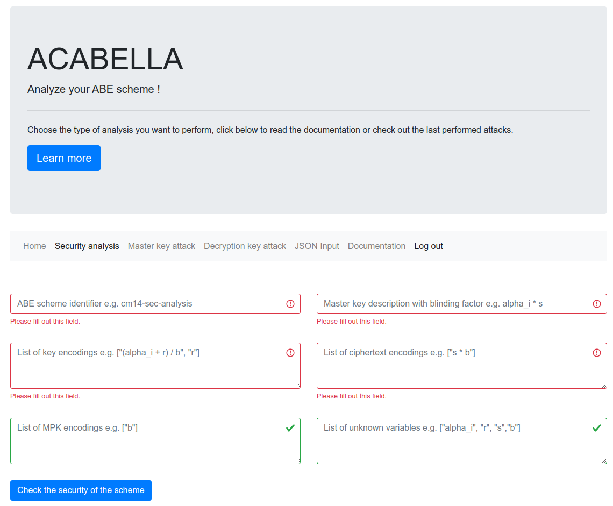

# ACABELLA

[](https://www.python.org/downloads/release/python-3100/)

ACABELLA is a tool for analyzing the security of attribute-based encryption (ABE) schemes.

ABE is a type of public-key encryption in which the keys are linked to attributes. It enforces access control on a cryptographic level in a fine-grained fashion. Both ABE and its multi-authority (MA) variant can be used in cloud settings and in medical environments to protect private data.

ACABELLA analyzes the security of ABE schemes by using purely algebraic approaches. In particular, the ACABELLA framework defines several properties that imply security proofs in the following frameworks:

 - [The AC17 framework](https://eprint.iacr.org/2017/233)
 - [The ABGW17 framework](https://eprint.iacr.org/2017/983)
 - [The RW22 framework](https://eprint.iacr.org/2022/1415)

If security cannot be proven, the tool tries to find an attack in the following framework: 

 - [The Venema-Alpar cryptanalysis framework](https://eprint.iacr.org/2020/460)

## Authors

ACABELLA was originally created by:

   - Antonio de la Piedra, Kudelski Security Research Team
   - Marloes Venema, University of Wuppertal and Raboud University
   - Greg Alpár, Open University of the Netherlands and Radboud University

The extension provided in the [ISABELLA](https://eprint.iacr.org/2024/1352) paper was created by:

- Doreen Riepel, UC San Diego
- Marloes Venema, University of Wuppertal
- Tanya Verma, Tinfoil

## In memoriam

We would like to honor the memory of Antonio, who worked on ACABELLA and the early stages of the Ven23 extension (which is covered by the ISABELLA extension), but sadly enough passed away before he could see the fruits of his labor. He is missed tremendously, and we hope that his memory carries on through his works, both those that he finished and worked on at the time of his death.

## The original tool versus the tool in this repository

The original tool can be found [here](https://github.com/abecryptools/ACABELLA). This is a slightly modified version of the ACABELLA tool, which also covers the ISABELLA extension.

## Requirements

- For ACABELLA:
    * `sympy`
  
- For the web application:
    * `click`
    * `Flask`
    * `Werkzeug`

- For running the tests:
    * `pytest`
  
- For generating the documentation:
    * `mkdocs`
    * `mkdocstrings[python]` 
    * `mkdocs-material`
    * `python-markdown-math`
    * `mkdocs-bibtex`

## Installation

After cloning the repository, create and activate a virtual environment:

```bash
$ python3 -m venv .venv

$ source .venv/bin/activate
```

Then, install all requirements.

Next, install in editing mode for easy development:

```bash
$ pip install -e .
```

## Running the tests

This project implements all the attacks presented in [1] as `pytests`. For installing
`pytest` run:

```bash
$ python3 -m pip install pytest
```

To run tests, from root directory run `$ pytest`

## Generating the documentation

This project uses mkdocs docstrings to generate the documentation of `ACABELLA`.
The following dependencies should be installed when working with the documentation:

```
python3 -m pip install mkdocs "mkdocstrings[python]" mkdocs-material python-markdown-math mkdocs-bibtex
```

- Run `mkdocs serve -v` to generate the documentation locally
- Run `mkdocs build` to generate the site to be hosted in Github Pages.

## The ACABELLA extension for ISABELLA

To run the ACABELLA extension provided in the ISABELLA framework, the following commands can be run in the main directory.
```bash
python3 main.py <jsonfile>
```

For example, to run the test on the PES-Ven23 specified in Section 5 of https://eprint.iacr.org/2023/143, you can run
```bash
python3 main.py examples/ven23/ven23_s5_normal.json
```

To output the substitution vectors and matrices as a JSON file, one can additionally append the command as follows:
```bash
python3 main.py <jsonfile> -o <name_of_output_file>.json
```

## Tools

ACABELLA provides different tools to analyze the security of ABE schemes:

### ACABELLA analysis command line tool

It receives a json input describing an ABE scheme and analyzes its security.

```bash
$ acabella --help
usage: acabella [-h] [--master-key CONFIG] [--decryption CONFIG] [--security CONFIG] [--conditional CONFIG] [--all CONFIG] [--insecure-only CONFIG]

ACABELLA cli for ABE scheme analysis

options:
  -h, --help            show this help message and exit
  --master-key CONFIG, -m CONFIG
                        Config file for Master Key attack analysis
  --decryption CONFIG, -d CONFIG
                        Config file for Decryption attack analysis
  --security CONFIG, -s CONFIG
                        Config file for Security analysis
  --conditional CONFIG, -c CONFIG
                        Config file for Conditional attack analysis
  --all CONFIG, -a CONFIG
                        Config file for performing all types of analyses
  --insecure-only CONFIG, -i CONFIG
                        Config file for comprehensive analysis if scheme is detected as insecure
```

For instance, to look for master key attacks we can use the following JSON input file:

```json
{
    "scheme_id": "cm14",
    "analysis": "master_key",
    "k": ["alpha + r * b", "r"],
    "master_key": "alpha",
    "unknown_vars" :  ["alpha", "b", "r"],
    "corruption_model" : "CA",
    "corruptable_vars": [
        { "type":"MPK_CA", "var":"b" }
         ],
    "MPK_CA": ["b"],
    "MSK_CA": ["alpha"],
    "MPK_AA": [],
    "MSK_AA": [],
    "MPK_vars": [],
    "GP_vars": []
} 
```

An example utilization in this case would be:

```bash
$ acabella --master-key examples/lxxh16/lxxh16_config_mka_corruption.json 

[*] Master key attack results:


List of encodings:
         k0[i][j] : alpha_i + b*r
         k1[i][j] : r

For the corruption of a Central Authority [i] in a model with several Attribute Authorities [j].

Structure of CA/AAs:
        Contents of the CA MPK encodings: [b]
        Contents of the AA MPK encodings: [alpha_i]

List of variables obtained via corruption:
        b from MPK_CA


[*] Master key attack with corruption found: 1*k0[i][j] + -b*k1[i][j]
```


### ACABELLA web application

It provides a web interface for analyzing the security of ABE schemes.
It can be launched by running `$ flask --app src/acabella/web --debug run` from the root directory.




## References

- [1] https://eprint.iacr.org/2020/460

